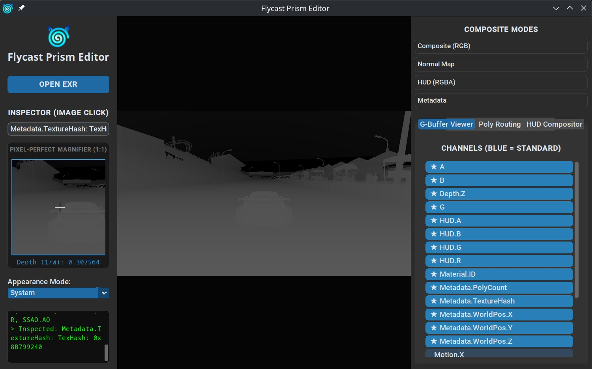
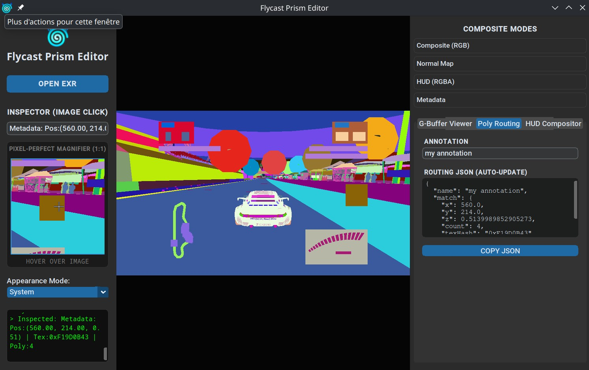
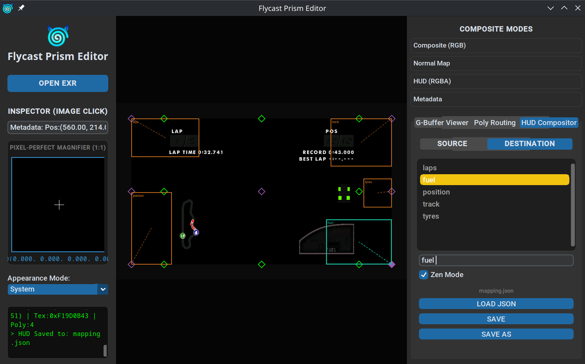

<p align="center">
  
</p>

# Flycast Prism Editor

A lightweight, cross-platform standalone viewer designed to inspect EXR files generated by the **[Flycast Prism](https://github.com/marcgardent/Flycast-Prism)** deferred rendering engine.

## Overview

Flycast Prism Editor provides a streamlined way to visualize, debug, and manipulate G-Buffer data exported from Flycast. It is an essential tool for developers and modders working on Dreamcast/Naomi rendering enhancements.

## Use Cases

### 1. G-Buffer Debugging
Visualize and inspect the individual layers of the Flycast Prism G-Buffer. You can toggle between Albedo, Normals, SSAO, Depth, and more to verify that the rendering pipeline is correctly capturing and processing scene data.



### 2. Polygon Identification & Routing
Identify specific polygons using metadata layers (Texture Hash, Polygon Count, etc.). This allows you to set up custom routing rules in Flycast Prism, which is crucial for isolating HUD elements.



### 3. HUD Recomposition
Adjust HUD placement for widescreen viewports. The integrated HUD Compositor allows you to define source and destination rectangles, ensuring the HUD remains perfectly positioned regardless of the rendering aspect ratio.



## Key Features

- **Multi-channel EXR Support:** Seamlessly load and switch between all G-Buffer channels.
- **Pixel-Perfect Inspector:** Hover over any pixel to see exact floating-point values for all channels.
- **HUD Compositor:** Interactive tool to define and save HUD layout configurations in JSON format.
- **Metadata Visualization:** Color-coded hashing for texture and material identification.

## Technical Stack

- **UI Framework:** [CustomTkinter](https://github.com/TomSchimansky/CustomTkinter) (Modern, dark-themed UI)
- **Image Processing:** [OpenImageIO](https://github.com/OpenImageIO/oiio) / [PyOpenEXR](https://github.com/jamesbowman/PyOpenEXR)
- **Environment Management:** Conda
- **Packaging:** PyInstaller / Briefcase

## Prerequisites

- **Conda** (Anaconda or Miniconda)
- **Python 3.10+**
- For packaging: `docker`

## Installation & Setup

1. **Clone the repository:**
   ```bash
   git clone https://github.com/marcgardent/Flycast-Prism-Editor.git
   cd Flycast-Prism-Editor
   ```

2. **Create the environment:**
   ```bash
   conda env create -f environment.yml
   conda activate Flycast-Prism-Editor
   ```

3. **Run the application:**
   ```bash
   python main.py
   ```

---
*Related Project:* **[Flycast Prism](https://github.com/marcgardent/Flycast-Prism)** - The deferred rendering branch of Flycast that produces the EXR files viewed here.